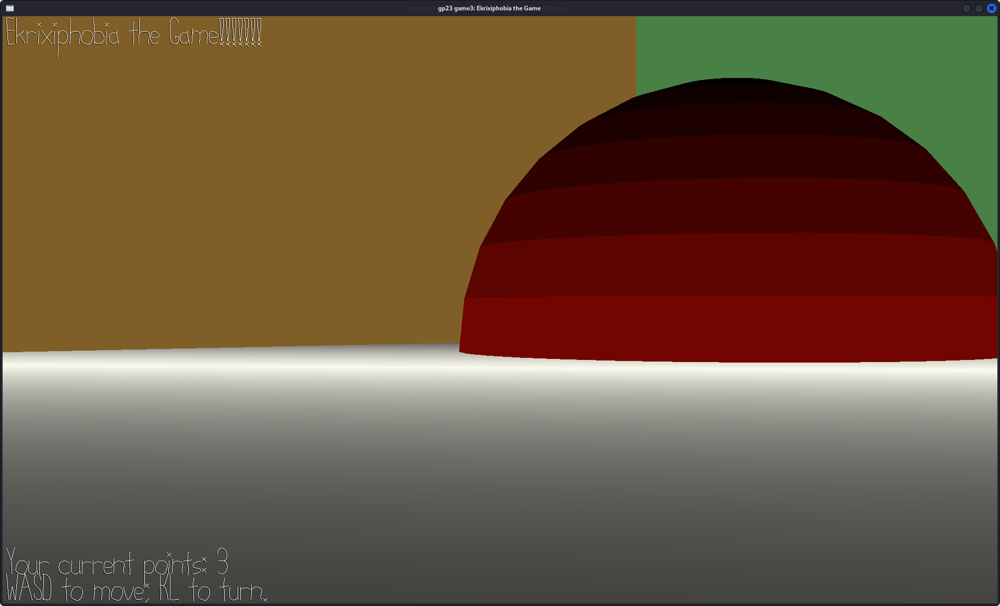

# Ekrixiphobia the Game!!!!!!!!!

Author: Sirui Huang

Design: Everyone loves explosions!... Until you got sucked into it. Luckily, you know how to dodge: it's common that before explosions take place, you hear alarms. Then you just need to walk away! Pay attention to where the alarm is coming from and get as far away as possible. You get points if you dodge! (Actually explosions get points at the same time so they become larger hehe)

Screen Shot:

How To Play:
WASD to move around! You can also use K and L to change directions you are heading. Play with headphones on and listen to where the alarm is coming from and avoid being caught up in explosions. When you have higher points, the explosions will also be larger.

This game was built with [NEST](NEST.md).
